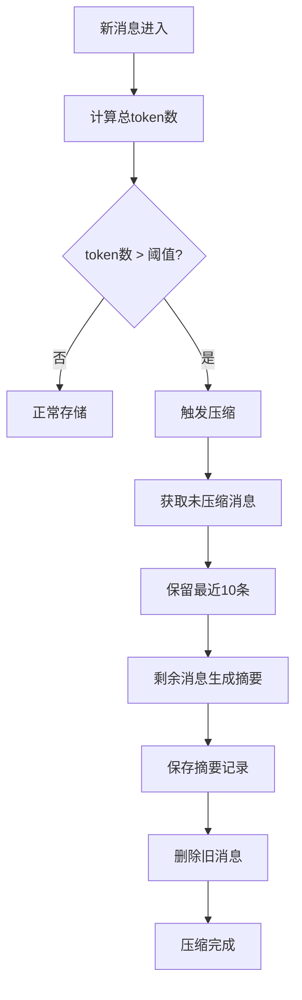

# 短期记忆和长期记忆（完整）实施指南 - SpringAISkills

## 一、实施概述

本指南将详细说明如何在SpringAISkills项目中实现短期记忆和长期记忆（完整）功能，**包含智能压缩机制**。

```
┌─────────────────────────────────────────────────────────────┐
│          记忆系统架构                                         │
├─────────────────────────────────────────────────────────────┤
│                                                               │
│  短期记忆（L1）                                               │
│  ├─ 实现：InMemoryChatMemory                                 │
│  ├─ 存储：JVM内存                                            │
│  ├─ 容量：最近10-20轮对话                                    │
│  └─ 用途：当前会话连续对话                                    │
│                                                               │
│  长期记忆（完整）                                             │
│  ├─ 实现：RelationalDatabaseMemory                           │
│  ├─ 存储：MySQL数据库                                        │
│  ├─ 容量：无限制（智能压缩）                                  │
│  ├─ 压缩：学习Claude Code，自动压缩旧消息                     │
│  └─ 用途：完整历史存档、审计                                  │
│                                                               │
└─────────────────────────────────────────────────────────────┘
```

## 二、智能压缩机制（学习Claude Code）

### 压缩原理

```
当token数量超过阈值（默认8000）
   ↓
保留最近10条消息不压缩
   ↓
旧消息通过LLM生成摘要
   ↓
删除旧消息，保存摘要
   ↓
查询时返回：压缩摘要 + 最近消息
```

### 压缩流程



### 压缩配置

```yaml
memory:
  compression:
    enabled: true              # 是否启用压缩
    token-threshold: 8000      # token阈值
    keep-recent: 10            # 保留最近N条消息
```

---

## 三、实施流程总览

```
步骤1: 数据库准备
   ↓
步骤2: Maven依赖配置
   ↓
步骤3: 配置文件修改
   ↓
步骤4: 创建Java文件（已完成）
   ↓
步骤5: 测试验证
```

---

## 四、详细实施步骤
#### 3.2 添加压缩配置

**操作**：在文件末尾添加

```yaml
memory:
  compression:
    enabled: true
    token-threshold: 8000
    keep-recent: 10
```

---

### 步骤4: 创建Java文件（已完成）

#### 文件清单

```
SpringAISkills/
├── src/main/java/com/springai/skills/
│   ├── memory/
│   │   ├── entity/
│   │   │   └── ChatRecord.java                  ✅ 实体类（含压缩字段）
│   │   ├── repository/
│   │   │   └── ChatHistoryRepository.java       ✅ Repository接口
│   │   ├── InMemoryChatMemory.java              ✅ 短期记忆实现
│   │   ├── RelationalDatabaseMemory.java        ✅ 长期记忆实现（含压缩）
│   │   └── MemoryManager.java                   ✅ 统一管理器
│   └── controller/
│       └── MemoryController.java                ✅ 控制器
├── src/main/resources/
│   └── memory-schema.sql                        ✅ 数据库初始化脚本
└── docs/
    ├── memory-implementation-guide.md           ✅ 详细实施指南
    └── quick-start-checklist.md                 ✅ 快速操作清单
```

---

### 步骤5: 测试验证（5分钟）

#### 5.1 启动应用

```bash
mvn spring-boot:run
```

#### 5.2 测试API

**测试1：带记忆的对话**
```bash
curl -X POST "http://localhost:8080/memory/chat?conversationId=conv-001&userId=user-001&message=你好"
```

**测试2：获取最近消息**
```bash
curl "http://localhost:8080/memory/recent?conversationId=conv-001&lastN=10"
```

**测试3：获取完整历史（包含压缩摘要）**
```bash
curl "http://localhost:8080/memory/complete?conversationId=conv-001"
```

**测试4：获取用户历史**
```bash
curl "http://localhost:8080/memory/user-history?userId=user-001&limit=100"
```

**测试5：获取记忆统计**
```bash
curl "http://localhost:8080/memory/stats?conversationId=conv-001&userId=user-001"
```

---

## 五、压缩机制详解

### 5.1 触发条件

```java
// 当token总数超过阈值时触发
if (totalTokens > tokenThreshold) {
    compressOldMessages(conversationId);
}
```

### 5.2 压缩过程

```java
// 1. 获取未压缩消息
List<ChatRecord> uncompressedMessages = findUncompressedMessages(conversationId);

// 2. 保留最近10条
int messagesToCompress = uncompressedMessages.size() - keepRecentMessages;

// 3. 生成摘要
String summary = generateSummary(oldMessages);

// 4. 保存摘要记录
ChatRecord summaryRecord = new ChatRecord(...);
summaryRecord.setSummary(summary);
summaryRecord.setIsCompressed(true);

// 5. 删除旧消息
deleteAll(oldMessages);
```

### 5.3 摘要生成

```java
// 使用LLM生成摘要
String summary = chatClientBuilder.build()
    .prompt()
    .user("请总结以下对话的关键信息，保留重要的上下文和决策：\n\n" + messages)
    .call()
    .content();

return "【历史摘要】" + summary;
```

### 5.4 查询优化

```java
// 查询时返回：压缩摘要 + 最近消息
List<ChatRecord> compressedSummaries = findCompressedSummaries(conversationId);
List<ChatRecord> recentMessages = findUncompressedMessages(conversationId);

// 合并返回
compressedSummaries.addAll(recentMessages);
```

---

## 六、性能优化

### 6.1 异步压缩

```java
@Async
protected void checkAndCompress(String conversationId) {
    // 压缩操作异步执行，不阻塞主流程
}
```

### 6.2 Token估算

```java
// 简单估算：字符数 * 0.5
private int estimateTokenCount(String content) {
    return (int) (content.length() * 0.5);
}
```

### 6.3 索引优化

```sql
-- 添加索引加速查询
INDEX idx_conversation_id (conversation_id),
INDEX idx_is_compressed (is_compressed),
INDEX idx_user_timestamp (user_id, timestamp)
```

---

## 七、监控和统计

### 7.1 记忆统计

```java
public MemoryStats getMemoryStats(String conversationId, String userId) {
    MemoryStats stats = new MemoryStats();
    stats.setShortTermMemoryCount(shortTermMemory.getMessageCount(conversationId));
    stats.setLongTermMemoryCount(longTermMemory.getMessageCount(conversationId));
    stats.setUserTotalMessageCount(longTermMemory.getUserMessageCount(userId));
    stats.setTotalTokenCount(longTermMemory.getTotalTokenCount(conversationId));
    return stats;
}
```

### 7.2 统计信息

```json
{
  "shortTermMemoryCount": 15,
  "longTermMemoryCount": 150,
  "userTotalMessageCount": 1500,
  "totalTokenCount": 8500
}
```

---

## 八、常见问题

### Q1: 压缩会丢失信息吗？

**答案**：会丢失部分细节，但保留关键信息。

**解决**：
- 调整`keep-recent`参数，保留更多最近消息
- 调整`token-threshold`参数，延迟压缩触发
- 查看摘要内容，确保关键信息被保留

### Q2: 如何禁用压缩？

**操作**：在application.yml中设置

```yaml
memory:
  compression:
    enabled: false
```

### Q3: 压缩频率如何控制？

**调整方式**：修改token阈值

```yaml
memory:
  compression:
    token-threshold: 10000  # 提高阈值，减少压缩频率
```

---

## 九、最佳实践

### 9.1 配置建议

```yaml
memory:
  compression:
    enabled: true
    token-threshold: 8000      # 根据模型上下文窗口调整
    keep-recent: 10            # 保留足够多的最近对话
```

### 9.2 监控建议

- 定期检查token统计
- 观察压缩频率
- 检查摘要质量

### 9.3 优化建议

- 使用更精确的token计数器
- 实现分级压缩策略
- 添加压缩日志记录

---

## 十、总结

### 核心特性

- ✅ 短期记忆：快速访问，连续对话
- ✅ 长期记忆：完整存档，永久保存
- ✅ 智能压缩：自动压缩旧消息，保留关键信息
- ✅ 异步处理：不阻塞主流程
- ✅ 可配置：灵活调整压缩参数

### 实施要点

1. **数据库准备**：先创建表，再启动应用
2. **依赖配置**：添加JPA和MySQL依赖
3. **配置文件**：添加数据库和压缩配置
4. **测试验证**：逐个测试API功能

### 下一步

完成实施后，可以考虑：
1. 添加L2语义记忆（向量检索）
2. 实现更精确的token计数
3. 添加压缩质量评估
4. 实现分级压缩策略


**实施完成！** 🎉

按照本指南操作，你就可以成功实现短期记忆和长期记忆（完整）功能，并享受智能压缩带来的性能优化！
